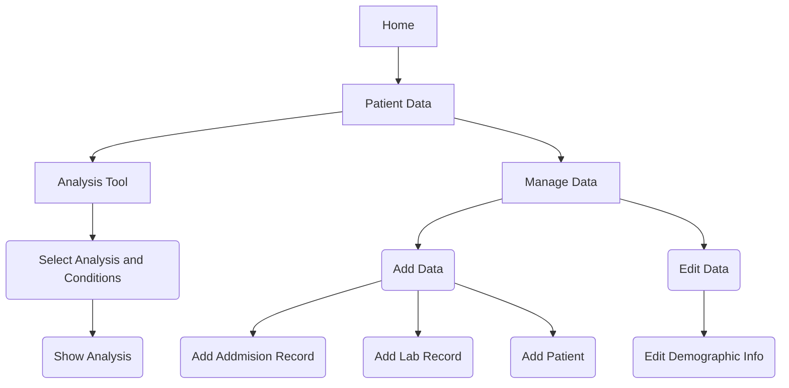

# Welcome to Veritas
Veritas is a prototype research oriented EHR built in R using RShiny.

## System Requirements
Veritas requires R version 4.0.2 and RStudio version 1.2.1073. It also requires the following R Libraries. 

`shiny`
`ggpubr`
`dplyr`
`ggplot2`
`sqldf`
`tidyverse`
`forcats`
`readr`
`benchmarkme`
`numbers`
`devtools`
`plyr`
`textreadr`
`stringr`
`utils`
`htmltools`
`rmarkdown`
`tinytex`
`pagedown`
`rmarkdown`
`shinyjs`
`pastecs`

ShinyJS must be installed directly from Github using the following command in the R Console:
`devtools::install_github("daattali/shinyjs")`

## How to Run

To run Veritas:
1. Open the main repo folder (which contains App.R) in RStudio
2. Set file source directory as working directory
3. Press `Run App	` in the top right corner of the RStudio workspace
# Using Veritas

Detailed instructions on how to use Veritas can be found on the `Home` tab after startup
# How Veritas Works

Veritas contains several screens to allow users to easily navigate the various functionalities. The landing page or `Home` page has a detailed description of how to use the application with relevant screenshots to aid the new user.

## Home Page
 From the `Home` page, users are encouraged to visit the `Patient Data` tab, the heart of EHR functionality. This is where users select the PatientID for the patient they would like to view. Selecting a patient will automatically generate and display a report of the patient's information, visit and diagnosis history, and lab results. From this page, the report can be downloaded as a PDF. Users can also navigate to data management options through several buttons on the `Patient Data` tab, as well as the `Manage Data` tab itself. 
 
 ## Manage Data Page
The `Manage Data` page has two main sub-tabs: `Add Data` and `Edit Data`. 

The `Add Data` tab has sub-tabs to `Add Admission Records` (meaning add clinical visit records), `Add Lab Record`, or `Add Patient`. 

The `Edit Data` tab gives the ability to edit core patient information, such as `Marital Status` or `Percentage Below Poverty Line`, which are patient values subject to change.

After adding or editing each item, the app links back to the `Patient Display` tab for easy viewing of changes.

## Analysis Page

